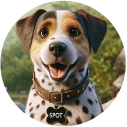
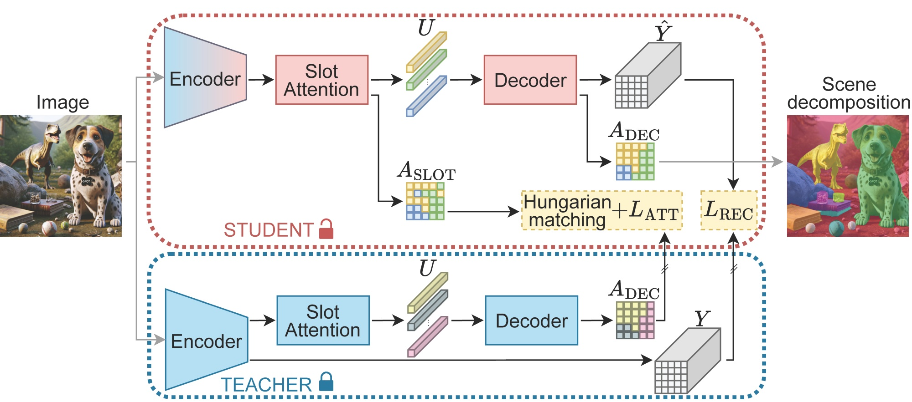

## SPOT: Self-Training with Patch-Order Permutation for Object-Centric Learning with Autoregressive Transformers

---

Accepted to CVPR 2024.

<div align="center">
  
</div>

---

## Contents

- [Installation](#installation)
- [COCO](#coco)
	- [Dataset Preparation](#dataset-preparation)
	- [Training SPOT](#training-spot-two-stage-approach)
   	- [Pretrained model](#pretrained-model)
	- [Evaluation](#evaluation)
 	- [Training DINOSAUR baseline](#training-dinosaur-baseline)
- [PASCAL VOC 2012](#pascal-voc-2012)
- [MOVi-C/E](#movi-ce)

---

## Installation

```bash
conda create -n spot python=3.9.16

conda activate spot

pip install -r requirements.txt --extra-index-url https://download.pytorch.org/whl/cu117
```

> All experiments run on a single GPU.

---

## COCO

### Dataset Preparation

Download COCO dataset (`2017 Train images`,`2017 Val images`,`2017 Train/Val annotations`) from [here](https://cocodataset.org/#download) and place them following this structure:

```bash
COCO2017
   ├── annotations
   │    ├── instances_train2017.json
   │    ├── instances_val2017.json
   │    └── ...
   ├── train2017
   │    ├── 000000000009.jpg
   │    ├── ...
   │    └── 000000581929.jpg
   └── val2017
        ├── 000000000139.jpg
        ├── ...
        └── 000000581781.jpg
```


### Training SPOT (two-stage approach)

**Stage 1**: Train SPOT Teacher for 50 epochs on COCO:

```bash 
python train_spot.py --dataset coco --data_path /path/to/COCO2017 --epochs 50 --num_slots 7 --train_permutations random --eval_permutations standard --log_path /path/to/logs/spot_teacher_coco
```

 > You can monitor the training progress with tensorboard:
 >
 > `tensorboard --logdir /path/to/logs/spot_teacher_coco --port=16000`

**Stage 2**: Train SPOT (student) for 50 epochs on COCO (this produces the final SPOT model):

```bash 
python train_spot_2.py --dataset coco --data_path /path/to/COCO2017 --epochs 50 --num_slots 7 --train_permutations random --eval_permutations standard --teacher_train_permutations random --teacher_eval_permutations random --teacher_checkpoint_path /path/to/logs/spot_teacher_coco/TIMESTAMP/checkpoint.pt.tar --log_path /path/to/logs/spot_coco
```

> If you are interested in MAE encoder, download pre-trained weights `ViT-Base` from [here](https://github.com/facebookresearch/mae/tree/main?tab=readme-ov-file#fine-tuning-with-pre-trained-checkpoints) and add:
>
> --which_encoder mae_vitb16 --pretrained_encoder_weights mae_pretrain_vit_base.pth --lr_main 0.0002 --lr_min 0.00004


### Pretrained model

Download pretrained SPOT model on COCO.

<table>
  <tr>
    <th>mBO^i</th>
    <th>mBO^c</th>
    <th>Download</th>
  </tr>
  <tr>
    <td>34.9</td>
    <td>44.8</td>
    <td><a href="https://drive.google.com/file/d/1LLcJ3zrSlwSVda7p1UQg3NBRbrpeqBg1/view?usp=sharing">Checkpoint</a></td>
  </tr>
</table>


### Evaluation

Evaluate **SPOT** on COCO aggregating all sequence permutations:

```bash 
python eval_spot.py --dataset coco --data_path /path/to/COCO2017 --num_slots 7 --eval_permutations all --checkpoint_path /path/to/logs/spot_coco/TIMESTAMP/checkpoint.pt.tar
```


### Training DINOSAUR baseline

You can also train the baseline experiment **SPOT w/o self-training & w/o sequence permutation** (this is essentially [DINOSAUR](https://arxiv.org/abs/2209.14860) re-implementation) for 100 epochs on COCO:

```bash   
python train_spot.py --dataset coco --data_path /path/to/COCO2017 --epochs 100 --num_slots 7 --train_permutations standard --log_path /path/to/logs/spot_wost_wosq_coco
```

---

## PASCAL VOC 2012

### Dataset Preparation

Download PASCAL VOC 2012 dataset from `http://host.robots.ox.ac.uk/pascal/VOC/voc2012/VOCtrainval_11-May-2012.tar`, extract the files and copy `trainaug.txt` in `VOCdevkit/VOC2012/ImageSets/Segmentation`. The final structure should be the following:

```bash
VOCdevkit
   └── VOC2012
          ├── ImageSets
          │      └── Segmentation
          │             ├── train.txt
          │             ├── trainaug.txt
          │             ├── trainval.txt
          │             └── val.txt
          ├── JPEGImages
          │      ├── 2007_000027.jpg
          │      ├── ...
          │      └── 2012_004331.jpg
          ├── SegmentationClass
          │      ├── 2007_000032.png
          │      ├── ...
          │      └── 2011_003271.png
          └── SegmentationObject
                 ├── 2007_000032.png
                 ├── ...
                 └── 2011_003271.png
```

### Training SPOT (two-stage approach)

**Stage 1**: Train SPOT Teacher for 560 epochs on VOC:


```bash 
python train_spot.py --dataset voc --data_path /path/to/VOCdevkit/VOC2012 --epochs 560 --num_slots 6 --train_permutations random --eval_permutations standard --log_path /path/to/logs/spot_teacher_voc
```

**Stage 2**: Train SPOT (student) for 560 epochs on VOC (this produces the final SPOT model):

```bash 
python train_spot_2.py --dataset voc --data_path /path/to/VOCdevkit/VOC2012 --epochs 560 --num_slots 6 --train_permutations random --eval_permutations standard --teacher_train_permutations random --teacher_eval_permutations random --teacher_checkpoint_path /path/to/logs/spot_teacher_voc/TIMESTAMP/checkpoint.pt.tar --log_path /path/to/logs/spot_voc
```

### Pretrained model

Download pretrained SPOT model on PASCAL VOC 2012.

<table>
  <tr>
    <th>mBO^i</th>
    <th>mBO^c</th>
    <th>Download</th>
  </tr>
  <tr>
    <td>48.6</td>
    <td>55.7</td>
    <td><a href="https://drive.google.com/file/d/1o2T0VGbzd1eHvOJECBCCNbQ3s2n_UWyi/view?usp=sharing">Checkpoint</a></td>
  </tr>
</table>


### Evaluation

Evaluate **SPOT** on VOC aggregating all sequence permutations:

```bash 
python eval_spot.py --dataset voc --data_path /path/to/VOCdevkit/VOC2012 --num_slots 6 --eval_permutations all --checkpoint_path /path/to/logs/spot_voc/TIMESTAMP/checkpoint.pt.tar
```

---

## MOVi-C/E

### Dataset Preparation

To download MOVi-C/E datasets, uncomment the last two rows in `requirements.txt` to install the tensorflow_datasets package. Then, run the following commands:

```bash 
python download_movi.py --level c --split train
python download_movi.py --level c --split validation
python download_movi.py --level e --split train
python download_movi.py --level e --split validation
```

The structure should be the following:

```bash
 MOVi
  ├── c
  │    ├── train
  │    │      ├── 00000000
  │    │      │       ├── 00000000_image.png
  │    │      │       └── ...
  │    │      └── ...
  │    └── validation
  │           ├── 00000000
  │           │       ├── 00000000_image.png
  │           │       ├── 00000000_mask_00.png
  │           │       └── ...
  │           └── ...
  └── e
       ├── train
       │      └── ...
       └── validation
              └── ...
```
### Training SPOT (two-stage approach)

**Stage 1**: Train SPOT Teacher for 65 epochs on MOVi-C:


```bash 
python train_spot.py --dataset movi --data_path /path/to/MOVi/c --epochs 65 --num_slots 11 --train_permutations random --eval_permutations standard --log_path /path/to/logs/spot_teacher_movic --val_mask_size 128 --lr_main 0.0002 --lr_min 0.00004
```


**Stage 2**: Train SPOT (student) for 30 epochs on MOVi-C (this produces the final SPOT model):

```bash 
python train_spot_2.py --dataset movi --data_path /path/to/MOVi/c --epochs 30 --num_slots 11 --train_permutations random --eval_permutations standard --teacher_train_permutations random --teacher_eval_permutations random --teacher_checkpoint_path /path/to/logs/spot_teacher_movic/TIMESTAMP/checkpoint.pt.tar --log_path /path/to/logs/spot_movic --val_mask_size 128 --lr_main 0.0002 --lr_min 0.00015 --predefined_movi_json_paths train_movi_paths.json
```

### Evaluation

Evaluate **SPOT** on MOVi-C aggregating all sequence permutations:

```bash 
python eval_spot.py --dataset voc --dataset movi --data_path /path/to/MOVi/c --num_slots 11 --eval_permutations all --checkpoint_path /path/to/logs/spot_movic/TIMESTAMP/checkpoint.pt.tar
```

>For MOVi-E experiments use --num_slots 24

---
## License

This project is licensed under the MIT License.

## Acknowledgement

This repository is built using the [SLATE](https://github.com/singhgautam/slate) and [OCLF](https://github.com/amazon-science/object-centric-learning-framework) repositories.

## Citation
If you find this repository useful, please consider giving a star :star: and citation:
```
@misc{kakogeorgiou2024spot,
      title={SPOT: Self-Training with Patch-Order Permutation for Object-Centric Learning with Autoregressive Transformers}, 
      author={Ioannis Kakogeorgiou and Spyros Gidaris and Konstantinos Karantzalos and Nikos Komodakis},
      url={https://arxiv.org/abs/2312.00648},
      journal={arXiv.org},
      year={2023}
      }
```
